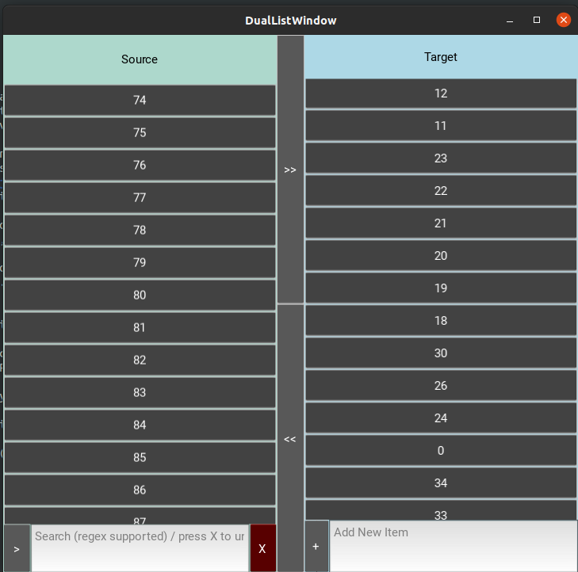

# Project Name: DualListBox Widget for Kivy
## Description
This project implements a `DualListBox` widget using Kivy. The widget provides a dual-list interface where you can move items from a source list to a target list. This README provides an overview of the widget and how to use it.

## Getting Started

### Prerequisites
Make sure you have the following prerequisites before using the widget:

- Kivy 1.11.0

### Screenshots

